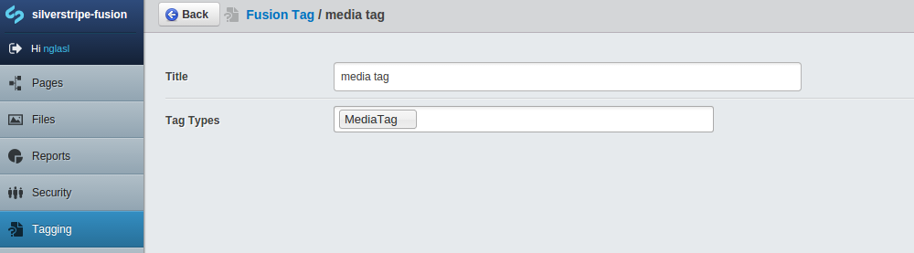
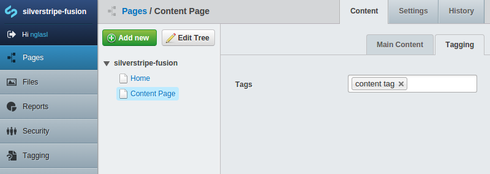
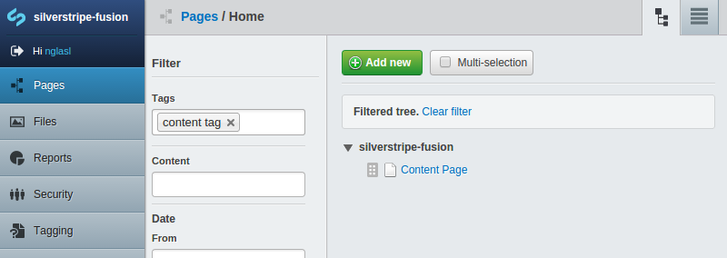

# [fusion](https://packagist.org/packages/nglasl/silverstripe-fusion)

_The current release is **1.0.0**_

	A module for SilverStripe which will automatically consolidate existing tag types
	into new fusion tags, and allows searchable content tagging out of the box.

## Requirement

* SilverStripe 3.1.X

## Getting Started

* Place the module under your root project directory.
* `/dev/build`
* Select `Tagging` through the CMS.

## Overview

### Tags

These will be automatically consolidated, based on data objects ending with `Tag`. To further customise this process, you may define the following configuration:

```yaml
FusionService:
  custom_tag_types:
    TagName: 'Attribute'
```

### Tag Management




The fusion tags are managed like any other data object, where tag types reflect those that have been consolidated. This pushes changes out to those respective tag types, maintaining any functionality directly requiring a tag that has been consolidated.

### Searchable Content Tagging





The fusion tags are immediately available to pages out of the box, allowing searchable content tagging for both content authors and users.

To enable tagging for a data object:

```yaml
DataObjectName:
  extensions:
    - 'TaggingExtension'
```

## Maintainer Contact

	Nathan Glasl, nathan@silverstripe.com.au
