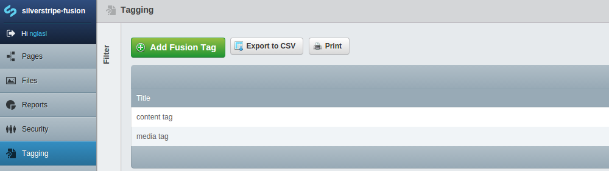

# [fusion](https://packagist.org/packages/nglasl/silverstripe-fusion)

_The current release is **1.0.0**_

	A module for SilverStripe which will automatically consolidate existing tag types
	into new fusion tags, and allows searchable content tagging out of the box.

## Requirement

* SilverStripe 3.1.X

## Getting Started

* Place the module under your root project directory.
* `/dev/build`
* Select `Tagging` through the CMS.

## Overview

### Tags

Tags will be automatically consolidated, based on data objects ending with `Tag`. To hook into this process, you may define the following configuration:

```yaml
FusionService:
  custom_tags:
    Tag: 'Field'
```

### Management




The fusion tag types will reflect tags that were consolidated, and are defined to push changes out to those respective tags. This will help maintain any custom functionality or relationships that directly require the consolidated tags.

### Searchable Content Tagging


Tags may be added against pages out of the box, however the `TaggingExtension` may be applied to any data object. This will also instantiate a database field that is used for searching.


Tags may also be filtered through the CMS.

## Maintainer Contact

	Nathan Glasl, nathan@silverstripe.com.au
